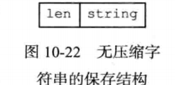

* Redis是一个键值对数据库服务器，服务器中通常包含着任意个非空数据库，而每个非 空数据库中又可以包含任意个键值对，为了方便起见，我们将服务器中的非空数据库以及它 们的键值对统称为数据库状态。
* 因为Redis是内存数据库，它将自己的数 据库状态储存在内存里面，所以如果不想办 法将储存在内存中的数据库状态保存到磁盘 里面，那么一旦服务器进程退出，服务器中的数据库状态也会消失不见。
* 为了解决这个问题，Redis提供了 RDB持久化功能，这个功能可以将Redis在内存中的 数据库状态保存到磁盘里面，避免数据意外丢失。
* RDB持久化既可以手动执行，也可以根据服务器配置选项定期执行，该功能可以将某 个时间点上的数据库状态保存到一个RDB文件中，如图10-2所示。
* RDB持久化功能所生成的RDB文件是一个经过压缩的二进制文件，通过该文件可以还 原生成RDB文件时的数据库状态。
* 因为RDB文件是保存在硬盘里面的，所以即使Redis服务器进程退出，甚至运行Redis 服务器的计算机停机，但只要RDB文件仍然存在，Redis服务器就可以用它来还原数据库 状态。

#### RDB文件的创建与载入

* 有两个Redis命令可以用于生成RDB文件，一个是 SAVE,另一个是 BGSAVE. SAVE命令会阻塞Redis服务器进程，直到RDB文件创建完毕为止，在服务器进程阻塞 期间，服务器不能处理任何命令请求：

* 和SAVE命令直接阻塞服务器进程的做法不同，BGSAVE命令会派生出一个子进程，然 后由子进程负责创建RDB文件，服务器进程(父进程)继续处理命令请求：

* 创建RDB文件的实际工作由rdb.c/rdbSave函数完成，岛吓命令和BGSAVE命令 会以不同的方式调用这个函数，通过以下伪代码可以明显地看出这两个命令之间的区别：

  ```c
  def SAVE ():
    #创建#庞文件
    rdbSave()
      
  def BGSAVE():
    #创建子进程
    pid = fork()
    if pid == 0:
      #子进程负责创建択如文件
      rdbSave()
      #完成之后向父进程发送信号
      signal_parent()
    elif pid > 0:
      #父进程继续处理命令请求，并通过轮询等待子进程的信号 handle_request_and_wait_signal()
  	else:
      #处理出错情况
      handle_fork_error()
  ```

* 和使用SAVE命令或者BGSAVE命令创建RDB文件不同，RDB文件的载入工作是在服 务器启动时自动执行的，所以Redis并没有专门用于载入RDB文件的命令，只要Redis服 务器在启动时检测到RDB文件存在，它就会自动载入RDB件。
* 另外值得一提的是，因为AOF文件的更新频率通常比RDB文件的更新频率高，所以： 
  * 如果服务器开启了 AOF持久化功能，那么服务器会优先使用AOF文件来还原数据库状态。
  * 只有在AOF持久化功能处于关闭状态时，服务器才会使用RDB文件来还原数据库状态。 
* 载入RDB文件的实际工作由rdb . c/rdbLoad函数完成

#####  SAVE命令执行时的服务器状态

* 前面提到过，当SAVE命令执行时，Redis服务器会被阻塞，所以当SAVE命令正在执 行时，客户端发送的所有命令请求都会被拒绝。
* 只有在服务器执行完SAVE命令、重新开始接受命令请求之后，客户端发送的命令才会被处理。

##### BGSAVE命令执行时的服务器状态

* 因为BGSAVE命令的保存工作是由子进程执行的，所以在子进程创建RDB文件的过程 中，Redis服务器仍然可以继续处理客户端的命令请求，但是，在BGSAVE命令执行期间， 服务器处理SAVE、BGSAVE、BGREWRITEAOF三个命令的方式会和平时有所不同。
  * 首先，在BGSMVE命令执行期间，客户端发送的SAVE命令会被服务器拒绝，服务器禁止SAVE命令和BGSAVE命令同时执行是为了避免父进程（服务器进程）和子进程同时执行两个rdbSave调用，防止产生竞争条件。
  * 其次，在BGSAVE命令执行期间，客户端发送的BGSAVE命令会被服务器拒绝，因为同时执行两个BGSAVE命令也会产生竞争条件。
  * 最后，BGREWRITEAOF和BGSAVE两个命令不能同时执行：
    * 如果BGSAVE命令正在执行，那么客户端发送的BGREWRITEAOF命令会被延迟到 BGSAVE命令执行完毕之后执行。
    * 如果BGREWRITEAOF命令正在执行，那么客户端发送的BGSAVE命令会被服务器拒绝。
  * 因为BGREWRITEAOF和两个命令的实际工作都由子进程执行，所以这两个命令在操作方面并没有什么冲突的地方，不能同时执行它们只是一个性能方面的考虑——并发出两个子进程，并且这两个子进程都同时执行大量的磁盘写入操作，这怎么想都不会是一 个好主意。

##### RDB文件载入时的服务器状态

* 服务器在载入RDB文件期间，会一直处于阻塞状态，直到载入工作完成为止。

#### 自动间隔性保存

* 在上一节，我们介绍了SAVE命令和BGSAVE的实现方法，并且说明了这两个命令在实现方面的主要区别：

  * SAVE命令由服务器进程执行保存工作，BGSAVE命令则由子进程执行保存工作，所以吓命令会阻塞服务器，而BGSAVE则不会。
  * 因为BGSAVE命令可以在不阻塞服务器进程的情况下执行，所以Redis允许用户通过设置服务器配置的save选项，让服务器每隔一段时间自动执行一次BGSAVE命令。
  * 用户可以通过save选项设置多个保存条件，但只要其中任意一个条件被满足，服务器就会执行BGSAVE命令。

* 举个例子，如果我们向服务器提供以下配置：

  ```
  save 900 1
  save 300 10
  save 60 10000
  ```

  那么只要满足以下三个条件中的任意一个，BGSSm命令就会被执行：

  * 服务器在900秒之内，对数据库进行了至少1次修改。
  * 服务器在300秒之内，对数据库进行了至少10次修改。
  * 服务器在60秒之内，对数据库进行了至少10000次修改。

##### 设置保存条件

* 当Redis服务器启动时，用户可以通过指定配置文件或者传入启动参数的方式设置save 选项，如果用户没有主动设置save选项，那么服务器会为save选项设置默认条件：

  ```
  save 900 1
  save 300 10
  save 60 10000
  ```

  接着，服务器程序会根据save选项所设置的保存条件，设置服务器状态redisServer 结构的saveparams属性：

  ```c
  struct redisServer {
    //记录了保存条件的数组 
    struct saveparam *saveparams;
    //
  ｝；
  ```

  saveparams属性是一个数组，数组中的每个元素都是一个saveparam结构，每个 saveparam结构都保存了一个save选项设置的保存条件：

  ```c
  struct saveparam (
    //秒数
    seconds;
    //修改数
    int changes;
  ｝；
  ```

##### dirty 计数器和 lastsave 属性

* 除了 saveparams数组之外，服务器状态还维持着一个dirty计数器，以及一个 lastsave 属性：

* dirty计数器记录距离上一次成功执行SAVE命令或者BGSAVE命令之后，服务器对数据库状态（服务器中的所有数据库）进行了多少次修改（包括写入、删除、更新等操作）

* lastsave属性是一个UNIX时间戳，记录了服务器上一次成功执行 SAVE 命令或者BGSAVE命令的时间。

  ```c
  struct redisServer （
    //修改计数器 
    long long dirty;
    //上一次执行保存的时间 
    time_t lastsave; 
  }
  ```

  当服务器成功执行一个数据库修改命令之后，程序就会对dirty计数器进行更新：命令修改了多少次数据库，dirty计数器的值就增加多少。

##### 检查保存条件是否满足

* Redis的服务器周期性操作函数serverCron默认每隔100毫秒就会执行一次，该函数用于对正在运行的服务器进行维护，它的其中一项工作就是检查save选项所设置的保存条件是否已经满足，如果满足的话，就执行BGSAVE命令。

* 以下伪代码展示了 serverCron 函数检査保存条件的过程：

  ```c
  def serverCron ():
      # ...
      #遍历所有保存条件
      for saveparam in server.saveparams:
          #计算距离上次执行保存操作有多少秒 
          save_interval = unixtime_now() - server.lastsave
          #如果数据库状态的修改次数超过条件所设置的次数
          #并且距离上次保存的时间超过条件所设置的时间
          #那么执行保存操作 
          if server.dirty >= saveparam.changes and save_interval > saveparam.seconds:
              BGSAVE()
  ```
  
程序会遍历并检查saveparams数组中的所有保存条件，只要有任意一个条件被满足, 那么服务器就会执行BGSAVE命令。

#### RDB文件结构

* 一个完整RDB文件所包含的各个部分

  

  * 为了方便区分变量、数据、常量，图中用全大写单词标示常量，用全小写单词标示变量和数据。

* RDB文件的最开头是REDIS部分，这个部分的长度为5字节，保存着"REDIS”五个字符。通过这五个字符，程序可以在载入文件时，快速检査所载入的文件是否RDB文件。

* 因为RDB文件保存的是二进制数据，而不是C字符串，为了简便起见，我们用 "REDIS"符号代表'R' . 'E'，'D'，'I', 'S'五个字符，而不是带，\ 0，结尾符号的C 字符串'R',  'E' , 'D' , 'I', 'S'. '\0' 

* db_version长度为4字节，它的值是一个字符串表示的整数，这个整数记录了 RDB 文件的版本号，比如"0006"就代表RDB文件的版本为第六版。

* databases部分包含着零个或任意多个数据库，以及各个数据库中的键值对数据：

  * 如果服务器的数据库状态为空（所有数据库都是空的），那么这个部分也为空，长度 为0字节。
  * 如果服务器的数据库状态为非空（有至少一个数据库非空），那么这个部分也为非空， 根据数据库所保存键值对的数量、类型和内容不同，这个部分的长度也会有所不同。

* EOF常量的长度为1字节，这个常量标志着RDB文件正文内容的结束，当读入程序遇 到这个值的时候，它知道所有数据库的所有键值对都已经载入完毕了。

* checksum是一个8字节长的无符号整数，保存着一个校验和，这个校验和是程序通 过对REDIS、db_version、databases、EOF四个部分的内容进行计算得出的。服务器 在载入RDB文件时，会将载人数据所计算出的校验和与check_sum所记录的校验和进行 对比，以此来检查RDB文件是否有出错或者损坏的情况出现。

  

##### databases 部分

* 一个RDB文件的databases部分可以保存任意多个非空数据库。

* 例如，如果服务器的0号数据库和3号数据库非空，那么服务器将创建一个如图所示的RDB文件，图中的database 0代表0号数据库中的所有键值对数据，而 database 3则代表3号数据库中的所有键值对数据。

  

* 每个非空数据库在RDB文件中都可以保存为SELECTDB、db_number , key_value_ pairs三个部分，如图所示。

  

* SELECTDB常量的长度为1字节，当读入程序遇到这个值的时候，它知道接下来要读入的将是一个数据库号码。

* db_number保存着一个数据库号码，根据号码的大小不同，这个部分的长度可以是1字 节、2字节或者5字节。当程序读入db_number部分之后，服务器会调用SELECT命令，根 据读入的数据库号码进行数据库切换，届得之后读入的键值对可以载入到正确的数据库中。

* key_value_Pairs部分保存了数据库中的所有键值对数据，如果键值对带有过期时 间，那么过期时间也会和键值对保存在一起。根据键值对的数量、类型、内容以及是否有过 期时间等条件的不同，key_value_pairs部分的长度也会有所不同。

* 展示了一个完整的RDB文件，文 件中包含了 0号数据库和3号数据库

  

###### key__value_pairs 部分

* RDB文件中的每个key_value_pairs部分都保存了一个或以上数量的键值对，如果 键值对带有过期时间的话，甌么键值寿的过期时间也会被保存在内。

* 不带过期时间的键值对在RDB文件中由TYPE、key、value三部分组成

* TYPE记录了 value的类型，长度为1字节，值可以是以下常量的其中一个：

  ```c
  REDIS_RDB_TYPE_STRING
  REDIS_RDB_TYPE_LIST
  REDIS_RDB_TYPE_SET
  REDIS_RDB_TYPE_ZSET
  REDIS_RDB_TYPE_HASH
  REDIS_RDB_TYPE_LIST_ZIPLIST
  REDIS_RDB_TYPE_SET_INTSET
  REDIS_RDB_TYPE_ZSET_ZIPLIST
  REDIS_RDB_TYPE_HASH_ZIPLIST
  ```

  * 以上列岀的每个TYPE常量痴代表了一种对象类型或者底层编码，当服务器读入RDB 文件中的键值对数据时，程序会根据TYPE的值来决定如何读入和解释value的数据。 

* key和value分别保存了键值对的键对象和值对象

  * 其中key总是一个字符串对象，它的编码方式和REDIS_RDB_TYPE_STRING类型 的value ―样。根据内容长度的不同，key的长度也会有所不同。
  * 根据TYPE类型的不同，以及保存内容长度的不同，保存value的结构和长度也会 有所不同

* 带有过期时间的键值对在RDB文件中的结构如图所示

  

* 带有过期时间的键值对中的TYPE、key、value三个部分的意义，和前面介绍的 不带过期时间的键值对的TYPE、key、value三个部分的意义完全相同，至于新增的 EXPIRETIME_MS和ms,它们的意义如下：

  * EXPIRETIME_MS常量的长度为1字节，它告知读入程序，接下来要读入的将是一 个以毫秒为单位的过期时间。

  * ms是一个8字节长的带符号整数，记录着一个以毫秒为单位的UNIX时间戳，这个 时间戳就是键值对的过期时间。

    

##### value 的编码

* RDB文件中的每个value部分都保存了一个值对象.每个值对象的类型都由与之对应 的TYPE记录，根据类型的不同，value部分的结构、长度也会有所不同。

###### 字符串对象

* 如果TYPE的值为REDIS_RDB_TYPE_STRING,那么value保存的就是一个字符串 对象，字符串对象的编码可以是REDIS_ENCODING_INT或者REDIS_ENC0DING_RAW

* 如果字符串对象的编码为REDIS_ENCODING_INT,那么说明对象中保存的是长度不 超过32位的整数，这种编码的对象将以下图所示的结构保存。其中，ENCODING 的值可以是 REDIS_RDB_ENC_INT8、REDIS_RDB_ENC_INT 16 或者REDIS_RDB_ENC_INT32三个常量的其中一个，它们分别代表RDB文件使用8位 (bit)、16位或者32位来保存整数值integer

  

* 如果字符串对象的编码为REDIS_ENCODING_RAW,那么说明对象所保存的是一个字 符串值，根据字符串长度的不同，有压缩和不压缩两种方法来保存这个字符串：

  * 如果字符串的长度小于等于20字节，那么这个字符串会直接被原样保存
  * 如果字符串的长度大于20字节，那么这个字符串会被压缩之后再保存。
  * 注意， 以上两个条件是在假设服务器打开了 RDB文件压缩功能的情况下进行的，如果服务器 关闭了 RDB文件压缩功能，那么RDB程序总以无压缩的方式保存字符串值。具体信息可以参考redis . conf文件中关于rdbcompression选项的说明。

* 对于没有被压缩的字符串，RDB程序会以下图所示的结构来 保存该字符串。

  

  其中，string部分保存了字符串值本身，而len保存了字符串 值的长度。对于压缩后的字符串，RDB程序会以图10-23所示的结构 来保存该字符串。

* 对于压缩后的字符串，RDB程序会以图所示的结构 来保存该字符串

  

  其中，REDIS_RDB_ENC_LZF常量标志着字符串已经被LZF算法压缩过了，读入程序在碰到这个常量时，会根据之后的compressed_len, origin_ len和compressed_string三部分，对字符串进行解压缩：其中compressed_ len记录的是字符串被压缩之后的长度，而origin_len记录的是字符串原来的长度， compressed_string记录的则是被压缩之后的字符串。

###### 列表对象

* 如果 TYPE 的值为 REDIS_RDB_TYPE_LIST,那么 value 保存的就是一^t" REDIS_ ENCODING_LINKEDLIST编码的列表对象，RDB文件保存这种对象的结构如图所示。

  

  list_length记录了列表的长度，它记录列表保存了多少个项(item ),读入程序可 以通过这个长度知道自己应该读入多少个列表项。图中以item开头的部分代表列表的项，因为每个列表项都是一个字符串对象，所以程 序会以处理字符串对象的方式来保存和读入列表项。

###### 集合对象

* 如果TYPE的值为REDIS_RDB_TYPE_SET,那么value保存的就是一个REDIS_ ENCODING_HT编码的集合对象，RDB文件保存这种对象的结构如图所示

  

  其中，set_size是集合的大小，它记录集合保存了多少个元素，读入程序可以通过这 个大小知道自己应该读入多少个集合元素。图中以elem开头的部分代表集合的元素，因为每个集合元素都是一个字符串对象，所 以程序会以处理字符串对象的方式来保存和读入集合元素。

###### 哈希表对象

* 如果TYPE的值为REDIS_RDB_TYPE_HASH,那么value保存的就是一个REDIS_ ENCODING_HT编码的集合对象，RDB文件保存这种对象的结构如图所示：

  

  * hash_size记录了哈希表的大小，也即是这个哈希表保存了多少键值对，读入程序 可以通过这个大小知道自己应该读入多少个键值对。
  * 以key_value_pair开头的部分代表哈希表中的键值对，键值对的键和值都是字 符串对象，所以程序会以处理字符串对象的方式来保存和读入键值对

* 结构中的每个键值对都以键紧挨着值的方式排列在一起，如图所示。

  

* 因此，从更详细的角度看，结构可以进一步修改为

  

###### 有序集合对象

* 如果TYPE的值为REDIS_RDB_TYPE_ZSET,那么value保存的就是一个REDIS_ ENCODING_SKIPLIST编码的有序集合对象，RDB文件保存这种对象的结构如图所示

  

  * sorted_set_size记录了有序集合的大小，也即是这个有序集合保存了多少兀素， 读入程序需要根据这个值来决定应该读入多少有序集合元素。
  * 以element开头的部分代表有序集合中的元素，每个元素又分为成员（member）和分 值（score）两部分，成员是一个字符串对象，分值则是一个doubl e类型的浮点数，程序 在保存RDB文件时会先将分值转换成字符串对象，然后再用保存字符串对象的方法将分值 保存起来。

* 有序集合中的每个元素都以成员紧挨着分值的方式排列

  

* 因此，从更详细的角度看


###### INTSET编码的集合

* 如果TYPE的值为REDIS_RDB_TYPE_SET_INTSET,那么value保存的就是一^整 数集合对象，RDB文件保存这种对蚤的方法是，先将整数集合转换为字符串对象，然后将 这个字符串对象保存到RDB文件里面。
* 如果程序在读入RDB文件的过程中，碰到由整数集合对象转换成的字符串对象，那么 程序会根据TYPE值的指示，先读入字符串对象，再将这个字符串对象转换成原来的整数集 合对象。

###### ZIPLIST编码的列表、哈希表或者有序集合

* 如果 TYPE 的值为 REDIS_RDB_TYPE_LIST_ZIPLIST、REDIS_RDB_TYPE_HASH_ ZIPLIST 或者 REDIS_RDB_TYPE_ZSET_ZIPLIST,那么 value 保存的就是一个压缩列 表对象，RDB文件保存这种对象的方法是：
  * 将压缩列表转换成一个字符串对象。
  * 将转换所得的字符串对象保存到RDB文件。
* 如果程序在读入RDB文件的过程中，碰到由压缩列表对象转换成的字符串对象，那么 程序会根据TYPE值的指示，执行以下操作：
  *  读入字符串对象，并将它转换成原来的压缩列表对象。
  * 根据TYPE的值，设置压缩列表对象的类型：如果TYPE的值为REDIS_RDB_ TYPE_LIST_ZIPLIST,那么压缩列表对象的类型为列表；如果TYPE的值为REDIS_ RDB_TYPE_HASH_Z I PL I ST,那么压缩列表对象的类型为哈希表；如果TYPE的值为 REDIS_RDB_TYPE_ZSET_ZIPLIST,那么压缩列表对象的类型为有序集合。
* 从步骤2可以看出，由于TYPE的存在，即使列表、哈希表和有序集合三种类型都使用 压缩列表来保存，RDB读入程序也总可以将读入并转换之后得出的压缩列表设置成原来的 类型。

#### 分析RDB文件

* 我们使用od命令来分析Redis服务器产生的RDB文件，该命令可以用给定的格式转存 (dump )并打印输入文件。比如说，给定-c参数可以以ASCII编码的方式打印输入文件， 给定-X参数可以以十六进制的方式打印输入文件，诸如此类，具体的信息可以参考。d命 令的文档。

##### 不包含任何键值对的RDB文件

##### 包含字符串键的RDB文件

##### 关于分析RDB文件的说明

* 因为Redis本身带有RDB文件检査工具redis-check-dump,网上也能找到很多处 理RDB文件的工具，所以人工分析RDB文件的内容并不是学习Redis所必须掌握的技能。
* 不过从学习RDB文件的角度来看，人工分析RDB文件是一个不错的练习，这种练习 可以帮助我们熟悉RDB文件的结构和格式，如果读者有兴趣的话，可以在理解本章的内容 之后，适当地尝试一下。
* 最后要提醒的是，前面我们一直用。d命令配合-c参数来打印RDB文件，因为使用 ASCII编码打印RDB文件可以很容易地发现文件中的字符串内容。
* 但是，对于RDB文件中的数字值，比如校验和来说，通过ASCII编码来打印它并不容 易看出它的真实值，更好的办法是使用-ex参数调用。d命令，同时以ASCII编码和十六 进制格式打印RDB文件

#### 重点回顾

*  RDB文件用于保存和还原Redis服务器所有数据库中的所有键值对数据。
*  SAVE命令由服务器进程直接执行保存操作，所以该命令会阻塞服务器。
* BGSAVE令由子进程执行保存操作，所以该命令不会阻塞服务器。
* 服务器状态中会保存所有用save选项设置的保存条件，当任意一个保存条件被满 足时，服务器会自动执行BGSSKE命令。
*  RDB文件是一个经过压缩的二进制文件，由多个部分组成。
* 对于不同类型的键值对，RDB文件会使用不同的方式来保存它们。

