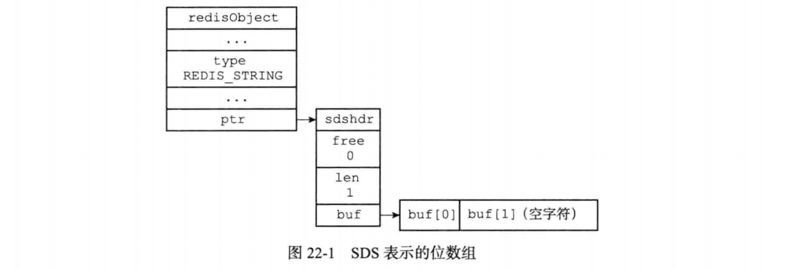
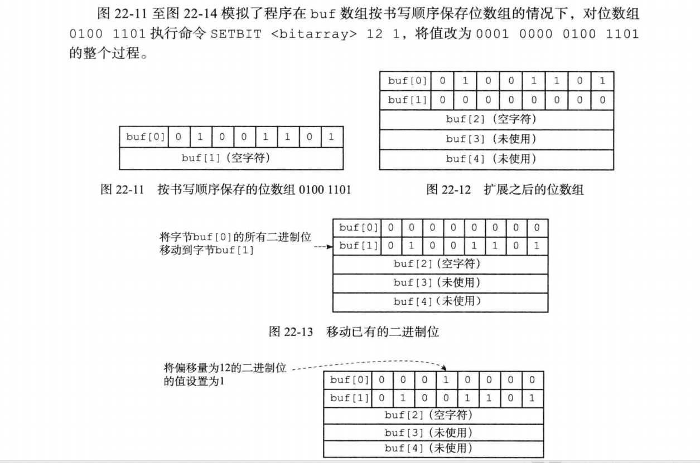

* Redis提供了 SETBIT、GETBIT、BITCOUNT、BITOP四个命令用于处理二进制位数组 (bitarray,又称“位数组”

* 其中，SETBIT命令用于为位数组指定偏移量上的二进制位设置值，位数组的偏移量从 0开始计数，而二进制位的值则可以是0或者1

  ```
  redis> SETBIT bit 0 1	# 0000 0001
  (integer) 0
  
  redis> SETBIT bit 3 1	# 0000 1001
  (integer) 0
  
  redis> SETBIT bit 0 0	# 0000 1000
  (integer) 1	
  ```

  而GETBIT命令则用于获取位数组指定偏移量上的二进制位的值：

  ```
  redis> GETBIT bit 0 # 0000 1000
  (integer) 0
  
  redis> GETBIT bit 3 # 0000 1000
  (integer) 1
  ```

  BITCOUNT命令用于统计位数组里面，值为1的二进制位的数量：

  ```
  redis> BITCOUNT bit   # 0000 1000
  (integer) 1
  
  redis> SETBIT bit 0 1 # 0000 1001
  (integer) 0
  
  redis> BITCOUNT bit
  (integer) 2
  
  redis> SETBIT bit 1 1 # 0000 1011
  (integer) 0
  
  redis> BITCOUNT bit
  (integer) 3
  ```

  最后，BITOP命令既可以对多个位数组进行按位与（and）、按位或（or）、按位异或 （xor）运算

#### 位数组的表示

* Redis使用字符串对象来表示位数组，因为字符串对象使用的SDS数据结构是二进制安全的

* 下图展示了用SDS表示的，一字节长的位数组：

  * redisObject.type的值为REDIS_STRING, 表示这是一个字符串对象。
  * sdshdr. len的值为1,表示这个SDS保存了一4字节长的位数组。
  * buf数组中的buf [0]字节保存了一字节长的位数组。
  * buf数组中的buf [1]字节保存了 SDS程序自动追加到值的末尾的空字符'\0'

  

* 需要注意的是，buf数组保存位数组的顺序和我们平时书写位数组的顺序是完全相反的。使用逆序来保存位数组可以简化SETBIT命令的实现。

#### GETBIT命令的实现

* GETBIT命令用于返回位数组bitarray在offset偏移量上的二进制位的值：`GETBIT <bitarray> <offset>`
* GETBIT命令的执行过程如下：
  1. 计算byte= lower(offset/8),  byte值记录了 offset偏移量指定的二进制位保存在位数组的哪个字节。
  2. 计算bit=(pffset mod 8)+1, bit值记录了 offset偏移量指定的二进制位是byte 字节的第几个二进制位。
  3. 根据byte值和bit值，在位数组bitarray中定位offset偏移量指定的二进 制位，并返回这个位的值。
  4. 因为GETBIT命令执行的所有操作都可以在常数时间内完成，所以该命令的算法复杂度为O(1)。

#### SETBIT命令的实现

* SETBIT用于将位数组bitarray在offset偏移量上的二进制位的值设置为value, 并向客户端返回二进制位被设置之前的旧值：`SETBIT <bitarray> <offset> <value>`

* 以下是SETBIT命令的执行过程：

  1. 计算 len = [offset / 8」+1, len值记录了保存offset偏移量指定的二进制位至少 需要多少字节。
  2. 检査bitarray键保存的位数组（也即是SDS）的长度是否小于len,如果是的话， 将SDS的长度扩展为len字节，并将所有新扩展空间的二进制位的值设置为0。
  3. 计算byte=[offset/8], byte值记录了 offset偏移量指定的二进制位保存在位数组的哪个字节。
  4. 计算bit = （ offset mod 8）+1, bit值记录了 offset偏移量指定的二进制位是 byte字节的第几个二进制位。
  5. 根据byte值和bit值，在bitarray键保存的位数组中定位offset偏移量指 定的二进制位，首先将指定二进制位现在值保存在oldvalue变量，然后将新值value设置为这个二进制位的值。
  6. 向客户端返回oldvalue变量的值。

* 因为SETBIT命令执行的所有操作都可以在常数时间内完成，所以该命令的时间复杂度为O(1)。

* 注意，因为buf数组使用逆序来保存位数组， 所以当程序对buf数组进行扩展之后，写入操作可以直接在新扩展的二进制位中完成，而不必改动位数组原来已有的二进制位。相反地，如果buf数组使用和书写位数组时一样的顺序来保存位数组，那么在每次扩展buf数组之后，程序都需要将位数组已有的位进行移动，然后才能执行写入操作，这比 SETBIT 命令目前的实现方式要复杂，并且移位带来的CPU时间消耗也会影响命令的执行速度。

  

#### BITCOUNT命令的实现

* BITCOUNT命令用于统计给定位数组中，值为1的二进制位的数量。
* BITCOUNT命令要做的工作初看上去并不复杂，但实际上要高效地实现这个命令并不 容易，需要用到一些精巧的算法。

##### 二进制位统计算法(1)：遍历算法

* 实现BITCOUNT命令最简单直接的方法，就 是遍历位数组中的每个二进制位，并在遇到值为 1的二进制位时，将计数器的值增一。
* 遍历算法虽然实现起来简单，但效率非常低， 因为这个算法在每次循环中只能检查一个二进制位的值是否为1,所以检査操作执行的次数将与位数组包含的二进制位的数量成正比。
* 例如，假设要检查的位数组的长度为100 MB, 那么按 1 MB = 1 000 000 Byte = 8 000 000 bit来计算，使用遍历算法检査长度为100 MB的 位数组将需要执行检查操作八亿次( 100 * 8 000 000 ) !而对于长度为500 MB的位数组来说，遍 历算法将需要执行检查操作四十亿次！
* 尽管遍历算法对单个二进制位的检查可以在 很短的时间内完成，但重复执行上亿次这种检 查肯定不是一个高效程序应有的表现，为了让 BITCOUNT命令的实现尽可能地高效，程序必须 尽可能地增加每次检査所能处理的二进制位的数 量，从而减少检查操作执行的次数。

##### 二进制位统计算法(2): 查表算法

* 优化检查操作的一个办法是使用査表法：
  * 对于一个有限集合来说，集合元素的排列方式是有限的。
  * 而对于一个有限长度的位数组来说，它能表示的二进制位排列也是有限的。根据这个原理，我们可以创建一个表，表的键为某种排列的位数组，而表的值则是相应位数组中，值为1的二进制位的数量。
  * 创建了这种表之后，我们就可以 根据输入的位数组进行査表，在无须对位数组的每个位进行检查的情况下， 直接知道这个位数组包含了多少个值为1的二进制位。
* 举个例子，对于8位长的位数组 来说，我们可以创建表格， 通过 这个表格，我们可以一次从位数组中读入8个位，然后根据这8个位的值进行查表，直接知道这个值包含了多少个值为1的位。
* 通过使用表,我们只需执行一次査表操作，就可以检査8个二进 制位，和之前介绍的遍历算法相比， 查表法的效率提升了 8倍：
  * 以 100 MB = 800 000 000 bit （八亿位）来计算，使用査表法处理长度为100 MB的位数组需要执行査表操作一亿次。
  * 而对于500 MB长的位数组来说，使用查表法处理该位数组需要执行五亿次查表操作。 
* 如果我们创建一个更大的表的话，那么每次査表所能处理的位就会更多，从而减少査表 操作执行的次数：如果我们将表键的大小扩展为16位，那么每次査表就可以处理16个二进制位，检 查100 MB长的二进制位只需要五千万次査表，检査500 MB长的二进制位只需要 两亿五千万次查表。
* 如果我们将表键的大小扩展为32位，那么每次査表就可以处理32个二进制位，检 査100 MB长的二进制位只需要两千五百万次査表，检查500 MB长的二进制位只 需要一亿两千五百万次査表。
* 初看起来，只要我们创建一个足够大的表，那么统计工作就可以轻易地完成，但这个问题实际上并没有那么简单，因为査表法的实际效果会受到内存和缓存两方面因素的限制：
  * 因为查表法是典型的空间换时间策略，算法在计算方面节约的时间是通过花费额外的内存换取而来的，节约的时间越多，花费的内存就越大。对于我们这里讨论的统计二进制位的问题来说，创建键长为8位的表仅需数百个字节，创建键长为16位 的表也仅需数百个KB,但创建键长为32位的表却需要十多个GB。在实际中，服务器只可能接受数百个字节或者数百KB的内存消耗。
  * 除了内存大小的问题之外，查表法的效果还会受到CPU缓存的限制：对于固定大小的CPU缓存来说，创建的表格越大，CPU缓存所能保存的内容相比整个表格的比例就越少，查表时出现缓存不命中(cache miss)的情况就会越高，缓存的换入和换出操作就会越频繁，最终影响査表法的实际效率。
* 由于以上列举的两个原因，我们可以得出结论，査表法是一种比遍历算法更好的统计办 法，但受限于査表法带来的内存压力，以及缓存不命中可能带来的影响，我们只能考虑创建键长为8位或者键长为16位的表，而这两种表带来的效率提升，对于处理非常长的位数组来说仍然远远不够。
* 为了高效地实现BITCOUNT命令，我们需要一种不会带来内存压力、并且可以在一次检査中统计多个二进制位的算法，接下来要介绍的variable-precision SWAR算法就是这样一 种算法。

##### 二进制位统计算法(3) ： variable-precision SWAR 算法

* BITCOUNT命令要解决的问题——统计一个位数组中非0二进制位的数量，在数学 被称为“计算汉明重量(Hamming Weight)。
* 因为汉明重量经常被用于信息论、编码理论和密码学，所以研究人员针对计算汉明重量 开发了多种不同的算法，一些处理器甚至直接带有计算汉明重量的指令，而对于不具备这 种特殊指令的普通处理器来说，目前已知效率最好的通用算法为variable-precision SWAR算 法，该算法通过一系列位移和位运算操作，可以在常数时间内计算多个字节的汉明重量，并且不需要使用任何额外的内存。

##### 二进制位统计算法（4）： Redis的实现

#### BITOP命令的实现

* 因为c语言直接支持对字节执行逻辑与（&）、逻辑或（|）、逻辑异或（^）和逻辑非 （~）操作，所以BITOP命令的AND、OR、XOR和NOT四个操作都是直接基于这些逻辑操作 实现的：

  * 在执行BITOP AND命令时，程序用&操作计算出所有输入二进制位的逻辑与结果, 然后保存在指定的键上面。
  * 在执行BITOP OR命令时，程序用丨操作计算出所有输入二进制位的逻辑或结果, 然后保存在指定的键上面。
  * 在执行BITOP XOR命令时，程序用人操作计算出所有输入二进制位的逻辑异或结果, 然后保存在指定的键上面。
  * 在执行BITOP NOT命令时，程序用~操作计算出输入二进制位的逻辑非结果，然后保存在指定的键上面。
* 举个例子，假设客户端执行命令： `BITOP AND result x y` 将执行以下操作：

  1. 创建一个空白的位数组value,用于保存AND操作的结果。
2. 对两个位数组的第一个字节执行buf[0] & buf[0] 并将结果保存到value [ 0 ]字节
  3. 对两个位数组的第二个字节执行buf[1] & buf[1] 并将结果保存到value [ 1 ]字节。
4. 对两个位数组的第三个字节执行buf [2] & buf [2] 并将结果保存到value [2 ]字节。
  5.  .......
* `BITOP OR、BITOP XOR、BITOP NOT`命令的执行过程和这里列出的 BITOP AND的执行过程类似。
* 因为BITOP AND、BITOP OR、BITOP XOR三个命令可以接受多个位数组作为输入， 程序需要遍历输入的每个位数组的每个字节来进行计算，所以这些命令的复杂度为 O(n^2); 与此相反，因为BITOP NOT命令只接受一个位数组输入，所以它的复杂度为O(n)。

#### 重点回顾

* Redis使用SDS来保存位数组。

* SDS使用逆序来保存位数组，这种保存顺序简化了 SETBIT 命令的实现，使得 SETBIT  命令可以在不移动现有二进制位的情况下，对位数组进行空间扩展。

* BITCOUNT命令使用了查表算法和variable-precision SWAR算法来优化命令的执行 效率。

* 位 BITOP 命令的所有操作都使用C语言内置的位操作来实现。

  