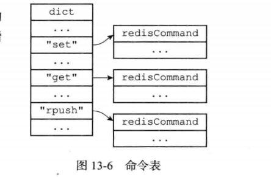
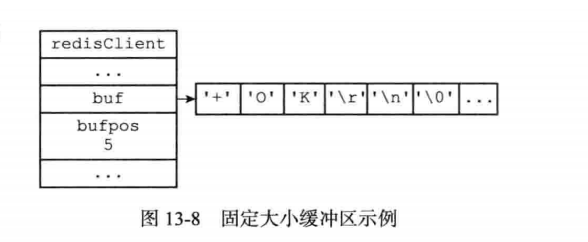
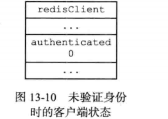
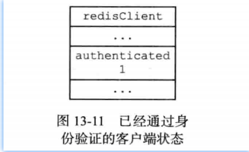

* Redis服务器是典型的一对多服务器程序:一个服务器可以与多个客户端建立网络连接，每个客户端可以向服务器发送命令请求，而服务器则接收并处理客户端发送的命令请求，并向客户端返回命令回复。
* 通过使用由I/O多路复用技术实现的文件事件处理器，Redis服务器使用单线程单进程的方式来处理命令请求，并与多个客户端进行网络通信。
* 对于每个与服务器进行连接的客户端，服务器都为这些客户端建立了相应的 `redis.h/redisClient` 结构(客户端状态)，这个结构保存了客户端当前的状态信息，以及执行相关功能时需要用到的数据结构，其中包括：
  * 客户端的套接字描述符。
  * 客户端的名字。
  * 客户端的标志值(flag)。
  * 指向客户端正在使用的数据库的指针，以及该数据库的号码。
  * 客户端当前要执行的命令、命令的参数、命令参数的个数，以及指向命令实现函数的指针。
  * 客户端的输入缓冲区和输出缓冲区。
  * 客户端的复制状态信息，以及进行复制所需的数据结构。
  * 客户端执行BRPOP、BLPOP等列表阻塞命令时使用的数据结构。
  * 客户端的事务状态，以及执行WATCH命令时用到的数据结构。
  * 客户端执行发布与订阅功能时用到的数据结构。
  * 客户端的身份验证标志。
  * 客户端的创建时间，客户端和服务器最后一次通信的时间，以及客户端的输出缓冲区大小超出软性限制(softlimit)的时间。
* Redis服务器状态结构的clients属性是一个链表，这个链表保存了所有与服务器连接的客户端的状态结构，对客户端执行批量操作，或者查找某个指定的客户端，都可以通过遍历clients链表来完成：
  ```c
  struct redisServer (
    // ...
    // 一个链表，保存了所有客户端状态
    list *clients;
    // ...
  }；
  ```

#### 客户端属性
* 客户端状态包含的属性可以分为两类：
  * 一类是比较通用的属性，这些属性很少与特定功能相关，无论客户端执行的是什么工作，它们都要用到这些属性。
  * 另外一类是和特定功能相关的属性，比如操作数据库时需要用到的db属性和dictid属性，执行事务时需要用到的instate属性，以及执行WATCH命令时需要用到的watched_keys属性等等。
  
##### 套接字描述符
* 客户端状态的fd属性记录了客户端正在使用的套接字描述符：
  ```c
  typedef struct redisClient {
    //
    int fd;
    // ...
  } redisClient;
  ```
* 根据客户端类型的不同，fd属性的值可以是-1或者是大于-1的整数：
  * 伪客户端(fake client)的fd属性的值为-1:伪客户端处理的命令请求来源于AOF文件或者Lua脚本，而不是网络，所以这种客户端不需要套接字连接，自然也不需
  要记录套接字描述符。目前Redis服务器会在两个地方用到伪客户端，一个用于载入AOF文件并还原数据库状态，而另一个则用于执行Lua脚本中包含的Redis命令。
  * 普通客户端的fd属性的值为大于-1的整数：普通客户端使用套接字来与服务器进行通信，所以服务器会用fd属性来记录客户端套接字的描述符。因为合法的套接字描述符不能是-1,所以普通客户端的套接字描述符的值必然是大于-1的整数。
* 执行CLIENT list命令可以列出目前所有连接到服务器的普通客户端，命令输出中的fd域显示了服务器连接客户端所使用的套接字描述符：
  ```
  redis> CLIENT list
  addr=127.0.0.1:53428 fd=6 name= age=1242 idle=0 ...
  addr=127.0.0.1:53469 fd=7 name= age=4 idle=4 ...
  ```

##### 名字
* 在默认情况下，一个连接到服务器的客户端是没有名字的。
* 使用CLIENT setname命令可以为客户端设置一个名字，让客户端的身份变得更清晰。
* 客户端的名字记录在客户端状态的name属性里面：
  ```c
  typedef struct redisClient {
    // ...
    robj *name;
    // ...
  } redisClient;
  ```
* 如果客户端没有为自己设置名字，那么相应客户端状态的name属性指向NULL指针；相反地，如果客户端为自己设置了名字，那么name属性将指向一个字符串对象，而该对象就保存着客户端的名字。

##### 客户端的标志属性
* flags记录了客户端的角色(role),以及客户端目前所处的状态: 
  ```c
  typedef struct redisClient {
      int flags;
      // ...
  ）redisClient;
  ```
* flags属性的值可以是单个标志： `flags = <flag>`
* 也可以是多个标志的二进制或，比如：`flags = <flagl> | <flag2> | ...`
* 每个标志使用一个常量表示，一部分标志记录了客户端的角色：
  * 在主从服务器进行复制操作时，主服务器会成为从服务器的客户端，而从服务器也会成为主服务器的客户端。REDIS_MASTER标志表示客户端代表的是一个主服务器，REDIS_SLAVE标志表示客户端代表的是一个从服务器。
  * REDIS_PRE_PSYNC标志表示客户端代表的是一个版本低于Redis2.8的从服务器，主服务器不能使用PSYNC命令与这个从服务器进行同步。这个标志只能在REDIS_SLAVE标志处于打开状态时使用。
  * REDIS_LUA_CLIENT标识表示客户端是专门用于处理Lua脚本里面包含的Redis命令的伪客户端。
* 而另外一部分标志则记录了客户端目前所处的状态：
  * REDIS_MONITOR标志表示客户端正在执行MONITER命令。
  * REDIS_UNIX_SOCKET标志表示服务器使用UNIX套接字来连接客户端。
  * REDIS_BLOCKED标志表示客户端正在被BRPOP、BLPOP等命令阻塞。
  * REDIS_UNBLOCKED标志表示客户端已经从REDIS_BLOCKED标志所表示的阻塞状态中脱离出来，不再阻塞。REDIS_UNBLOCKED标志只能在REDIS_BLOCKED标志已经打开的情况下使用。
  * REDIS_MULTI标志表示客户端正在执行事务。
  * REDIS_DIRTY_CAS标志表示事务使用WATCH命令监视的数据库键已经被修改
  * REDIS_DIRTY_EXEC标志表示事务在命令入队时岀现了错误，以上两个标志都表示事务的安全性已经被破坏，只要这两个标记中的任意一个被打开，EXEC命令必然会执行失败。这两个标志只能在客户端打开了REDIS_MULTI标志的情况下使用。
  * REDIS_CLOSE_ASAP标志表示客户端的输出缓冲区大小超出了服务器允许的范围，服务器会在下一次执行serverCron函数时关闭这个客户端，以免服务器的稳定性受到这个客户端影响。积存在输出缓冲区中的所有内容会直接被释放，不会返回给客户端。
  * REDIS_CLOSE_AFTER_REPLY标志表示有用户对这个客户端执行了 CLIENT KILL 命令，或者客户端发送给服务器的命令请求中包含了错误的协议内容。服务器会将客户端积存在输出缓冲区中的所有内容发送给客户端，然后关闭客户端。
  * REDIS_ASKING标志表示客户端向集群节点（运行在集群模式下的服务器）发送了 ASKING 命令。
  * REDIS_FORCE_AOF标志强制服务器将当前执行的命令写入到AOF文件里面， REDIS_FORCE_REPL标志强制主服务器将当前执行的命令复制给所有从服务器。 执行PUBSUB命令会使客户端打开REDIS_FORCE_AOF标志，执行SCRIPT LOAD 命令会使客户端打开REDIS_FORCE_AOF标志和REDIS_FORCE_REPL标志。
  * 在主从服务器进行命令传播期间，从服务器需要向主服务器发送REPLICATION ACK命令，在发送这个命令之前，从服务器必须打开主服务器对应的客户端的REDIS_MASTER_FORCE_REPLY标志，否则发送操作会被拒绝执行。
  * 以上提到的所有标志都定义在redis.h文件里面。
* PUBSUB命令和SCRIPT LOAD命令的特殊性
  * 通常情况下，Redis只会将那些对数据库进行了修改的命令写入到AOF文件，并复制到各个从服务器。如果一个命令没有对数据库进行任何修改，那么它就会被认为是只读命令，这个命令不会被写入到AOF文件，也不会被复制到从服务器。
  * 以上规则适用于绝大部分Redis命令，但PUBSUB命令和SCRIPT LOAD命令是其中的例外。PUBSUB命令虽然没有修改数据库，但PUBSUB命令向频道的所有订阅者发送消息这一
  行为带有副作用，接收到消息的所有客户端的状态都会因为这个命令而改变。因此，服务器需要使用REDIS_FORCE_AOF标志，强制将这个命令写入AOF文件，这样在将来载入AOF文
  件时，服务器就可以再次执行相同的PUBSUB命令，并产生相同的副作用。SCRIPT LOAD命令的情况与PUBSUB命令类似：虽然SCRIPT LOAD命令没有修改数据库，但它修改了服务
  器状态，所以它是一个带有副作用的命令，服务器需要使用REDIS_FORCE_AOF标志，强制将这个命令写入AOF文件，使得将来在载入 AOF文件时，服务器可以产生相同的副作用。
  另外，为了让主服务器和从服务器都可以正确地载入SCRIPT LOAD命令指定的脚 本，服务器需要使用REDIS_FORCE_REPL标志，强制将SCRIPT LOAD命令复制给所有从服务器。
* 以下是一些flags属性的例子：
  ```
  #客户端是一个主服务器
  REDIS_MASTER
  #客户端正在被列表命令阻塞
  REDIS_BLOCKED
  #客户端正在执行事务，但事务的安全性已被破坏
  REDIS_MULTII | REDIS_DIRTY_CAS
  #客户端是一个从服务器，并且版本低于Redis 2.8
  REDIS_SLAVE | REDIS_PRE_PSYNC
  #这是专门用于执行脚本的Redis命令的伪客户端
  #它强制服务器将当前执行的命令写入AOF文件，并复制给从服务器
  REDIS_LUA_CLIENT | REDIS_FORCE_AOF| REDIS_FORCE_REPL
  ```

##### 输入缓冲区
* 客户端状态的输入缓冲区用于保存客户端发送的命令请求:
  ```c
  typedef struct redisClient (
      // ...
      sds querybuf;
  } redisClient;
  ```
* 输入缓冲区的大小会根据输入内容动态地缩小或者扩大，但它的最大大小不能超过 1GB,否则服务器将关闭这个客户端。
* argv属性是一个数组，数组中的每个项都是一个字符串对象，其中argv\[0]是要执行的命令，而之后的其他项则是传给命令的参数。
* argc属性则负责记录argv数组的长度。

##### 命令的实现函数
* 当服务器从协议内容中分析并得出argv属性和argc属性的值之后，服务器将根据项argv[0]的值，在命令表中查找命令所对应的命令实现函数。
* 下图展示了一个命令表示例，该表是一个字典，字典的键是一个SDS结构，保存了命令的名字，字典的值是命令所对应的redisCommand结构，这个结构保存了命令的实现函数、命令的标志、命令应该给定的参数个数、命令的总执行次数和总消耗时长等统计信息。
  
* 当程序在命令表中成功找到argv[0]所对应的redisCommand结构时，它会将客户端状态的cmd指针指向这个结构：
  ```c
  typedef struct redisClient (
      // ...
      struct redisCommand *cmd;
      // ...
  } redisClient;
  ```
  之后，服务器就可以使用cmd属性所指向的redisCommand结构，以及argv、argc属性中保存的命令参数信息，调用命令实现函数，执行客户端指定的命令。
* 下图演示了服务器在argv[0]为"SET"时，査找命令表并将客户端状态的cmd指向目标redisCommand结构的整个过程。
  
* 针对命令表的査找操作不区分输入字母的大小写，所以无论argv[0]是"SET"、 "set".或者"SeT"等等，查找的结果都是相同的。

##### 输出缓冲区
* 执行命令所得的命令回复会被保存在客户端状态的输出缓冲区里面，每个客户端都有两个输出缓冲区可用，一个缓冲区的大小是固定的，另一个缓冲区的大小是可变的：
  * 固定大小的缓冲区用于保存那些长度比较小的回复，比如OK、简短的字符串值、整数值、错误回复等等。
  * 可变大小的缓冲区用于保存那些长度比较大的回复，比如一个非常长的字符串值, 一个由很多项组成的列表，一个包含了很多元素的集合等等。
* 客户端的固定大小缓冲区由buf和bufpos两个属性组成：
  ```c
  typedef struct redisClient (
      // ...
      char buf[REDIS_REPLY_CHUNK_BYTES];
      int bufpos;
  } redisClient;
  ```
* buf是一个大小为REDIS_REPLY_CHUNK_BYTES字节的字节数组，而bufpos属性则记录了buf数组目前已使用的字节数量。
* REDIS_REPLY_CHUNK_BYTES常量目前的默认值为16*1024,也即是说，buf数组的默认大小为16KB。
* 下图展示了一个使用固定大小缓冲区来保存返回值+OK\r\n的例子。
  
* 当buf数组的空间已经用完，或者回复因为太大而没办法放进buf数组里面时，服务器就会开始使用可变大小缓冲区。
* 可变大小缓冲区由reply链表和一个或多个字符串对象组成：
  ```c
  typedef struct redisClient (
  
      // ...
      list *reply;
      // ...
  
  } redisClient;
  ```
  通过使用链表来连接多个字符串对象，服务器可以为客户端保存一个非常长的命令回复，而不必受到固定大小缓冲区16KB大小的限制。
* 展示了一个包含三个字符串对象的reply链表。
  

##### 身份验证
* 客户端状态的authenticated属性用于记录客户端是否通过了身份验证:
  ```c
  typedef struct redisClient （
      // ...
      int authenticated;
  } redisClient;
  ```
* 如果authenticated的值为0,那么表示客户端未通过身份验证；如果authenticated的值为1,那么表示客户端已经通过了身份验证。
* 举个例子。对于一个尚未进行身份验证的客户端来说，客户端状态的authenticated属性将如图所示
  
* 当客户端authenticated属性的值为0时，除了AUTH命令之外，客户端发送的所有其他命令都会被服务器拒绝执行：
* 当客户端通过AUTH命令成功进行身份验证之后，客户端状态authenticated属性的值就会从0变为1,如图所示，这时客户端就可以像往常一样向服务器发送命令请求了：
  
* authenticated属性仅在服务器启用了身份验证功能时使用。如果服务器没有启用身份验证功能的话，那么即使authenticated属性的值为0（这是默认值），服务器也不会拒绝执行客户端发送的命令请求。
* 关于服务器身份验证的更多信息可以参考示例配置文件对requirepass选项的相关说明。

##### 时间
* 客户端还有几个和时间有关的属性：
  ```
  typedef struct redisClient (
      //...
      time_t ctime;
      time_t lastinteraction;
      time_t obuf_soft_limit_reached_time;
      // ...
  
  } redisClient;
  ```
* ctime属性记录了创建客户端的时间，这个时间可以用来计算客户端与服务器已经连接了多少秒，CLIENT list命令的age域记录了这个秒数：
* lastinteraction属性记录了客户端与服务器最后一次进行互动(interaction)的时间，这里的互动可以是客户端向服务器发送命令请求，也可以是服务器向客户端发送命令回复。
* lastinteraction属性可以用来计算客户端的空转(idle)时间，也即是距离客户端与服务器最后一次进行互动以来，已经过去了多少秒，CLIENT list命令的idle域记录了这个秒数：
* obuf_soft_limit_reached_time属性记录了输出缓冲区第一次到达软性限制 (soft limit)的时间。

#### 客户端的创建与关闭
* 服务器使用不同的方式来创建和关闭不同类型的客户端。

##### 创建普通客户端
* 如果客户端是通过网络连接与服务器进行连接的普通客户端，那么在客户端使用connect函数连接到服务器时，服务器就会调用连接事件处理器，为客户端创建相应的客户端状态，并将这个新的客户端状态添加到服务器状态结构clients链表的末尾。
* 举个例子，假设当前有c1和c2两个普通客户端正在连接服务器，那么当一个新的普通客户端c3连接到服务器之后，服务器会将c3所对应的客户端状态添加到clients链表的末尾，如图所示，其中用虚线包围的就是服务器为c3新创建的客户端状态。
  

##### 关闭普通客户端
* 一个普通客户端可以因为多种原因而被关闭：
  * 如果客户端进程退出或者被杀死，那么客户端与服务器之间的网络连接将被关闭，从而造成客户端被关闭。
  * 如果客户端向服务器发送了带有不符合协议格式的命令请求，那么这个客户端也会被服务器关闭。
  * 如果客户端成为了 client kill 命令的目标，那么它也会被关闭。
  * 如果用户为服务器设置了timeout配置选项，那么当客户端的空转时间超过timeout选项设置的值时，客户端将被关闭。不过timeout选项有一些例外情况：如果
  客户端是主服务器（打开了 REDIS_MASTER标志），从服务器（打开了 REDIS_SLAVE标志），正在被BLPOP等命令阻塞（打开了 REDIS_BLOCKED标志），或
  者正在执行SUBSCRIBE、PSUBSCRIBE等订阅命令，那么即使客户端的空转时间超过了timeout选项的值，客户端也不会被服务器关闭。
  * 如果客户端发送的命令请求的大小超过了输入缓冲区的限制大小（默认为1 GB）, 那么这个客户端会被服务器关闭。
  * 如果要发送给客户端的命令回复的大小超过了输出缓冲区的限制大小，那么这个客户端会被服务器关闭。
* 可变大小缓冲区由一个链表和任意多个字符串对象组成，理论上来说，这个缓冲区可以保存任意长的命令回复。但是，为了避免客户端的回复过大，占用过多的服务器资源，服务器会时刻检查客户端的输出缓冲区的大小，并在缓冲区的大小超出范围时执行相应的限制操作。
* 服务器使用两种模式来限制客户端输出缓冲区的大小：
  * 硬性限制（hard limit）:如果输出缓冲区的大小超过了硬性限制所设置的大小，那么服务器立即关闭客户端。
  * 软性限制（soft limit）:如果输出缓冲区的大小超过了软性限制所设置的大小，但还没超过硬性限制，那么服务器将使用客户端状态结构的obuf_soft_limit_reached_time属性记录下客户端到达软性限制的起始时间；
  之后服务器会继续监视客户端，如果输出缓冲区的大小一直超出软性限制，并且持续时间超过服务器设定的时长，那么服务器将关闭客户端；相反地，如果输出缓冲区的大小在指定时间之内，不再超出软性限制，那么客户端就不会被关闭，并且obuf_soft_limit_reached_time属性的值也会被清零。
* 使用client-output-buffer-limit选项可以为普通客户端、从服务器客户端、执行发布与订阅功能的客户端分别设置不同的软性限制和硬性限制，该选项的格式为： `client-output-buffer-limit <class> <hard limit> <soft limit> <soft seconds>`
  ```
  client-output-buffer-limit normal 0 0 0               # 将普通客户端的硬性限制和软性限制都设置为0,表示不限制客户端的输出缓冲区大小。
  client-output-buffer-limit slave 256mb 64mb 60        # 将从服务器客户端的硬性限制设置为256 MB,而软性限制设置为64 MB, 软性限制的时长为60秒。
  client-output-buffer-limit pubsub 32mb 8mb 60         # 将执行发布与订阅功能的客户端的硬性限制设置为32 MB,软性限制设置为8 MB,软性限制的时长为60秒。
  ```

##### Lua脚本的伪客户端
* 服务器会在初始化时创建负责执行Lua脚本中包含的Redis命令的伪客户端，并将这个伪客户端关联在服务器状态结构的lua_client属性中：
  ```c
  struct redisServer{
      redisClient *lua_client;
  };
  ```
* lua_client伪客户端在服务器运行的整个生命期中会一直存在，只有服务器被关闭时，这个客户端才会被关闭。

##### AOF文件的伪客户端
* 服务器在载入AOF文件时，会创建用于执行AOF文件包含的Redis命令的伪客户端, 并在载入完成之后，关闭这个伪客户端。

#### 重点回顾
* 服务器状态结构使用clients链表连接起多个客户端状态，新添加的客户端状态会被放到链表的末尾。
* 客户端状态的flags属性使用不同标志来表示客户端的角色，以及客户端当前所处的状态。
* 输入缓冲区记录了客户端发送的命令请求，这个缓冲区的大小不能超过1GB。
* 命令的参数和参数个数会被记录在客户端状态的argv和argc属性里面，而cmd属性则记录了客户端要执行命令的实现函数。
* 客户端有固定大小缓冲区和可变大小缓冲区两种缓冲区可用，其中固定大小缓冲区的最大大小为16 KB,而可变大小缓冲区的最大大小不能超过服务器设置的硬性限制值。
* 输出缓冲区限制值有两种，如果输出缓冲区的大小超过了服务器设置的硬性限制，那么客户端会被立即关闭；除此之外，如果客户端在一定时间内，一直超过服务器设置的软性限制，那么客户端也会被关闭。
* 当一个客户端通过网络连接连上服务器时，服务器会为这个客户端创建相应的客户端状态。网络连接关闭、发送了不合协议格式的命令请求、成为CLIENT KILL命令的目标、空转时间超时、输出缓冲区的大小超出限制，以上这些原因都会造成客户端被关闭。
* 处理Lua脚本的伪客户端在服务器初始化时创建，这个客户端会一直存在，直到服务器关闭。
* 载入AOF文件时使用的伪客户端在载入工作开始时动态创建，载入工作完毕之后关闭。
