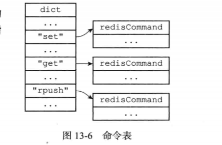
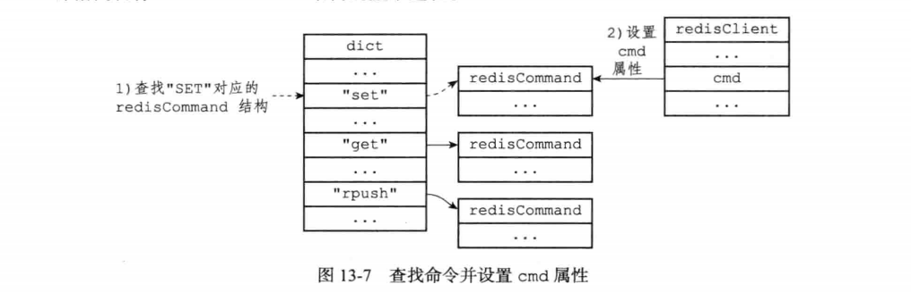
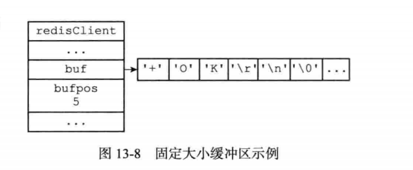
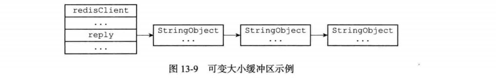
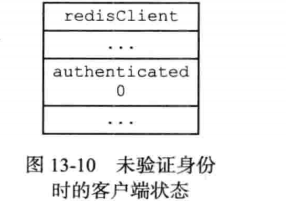
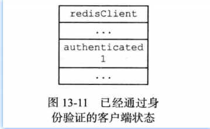
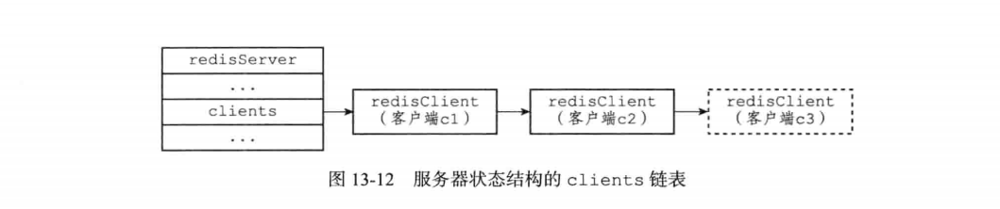

##### 客户端的标志属性

* flags记录了客户端的角色（role）,以及客户端目前所处的状态: 

  ```c
  typedef struct redisClient {
      int flags;
      // ...
  ）redisClient;
  ```

* flags属性的值可以是单个标志： `flags = <flag>`

* 也可以是多个标志的二进制或，比如：`flags = <flagl> | <flag2> | ...`

* 每个标志使用一个常量表示，一部分标志记录了客户端的角色：

  * 在主从服务器进行复制操作时，主服务器会成为从服务器的客户端，而从服务器也会成为主服务器的客户端。REDIS_MASTER标志表示客户端代表的是一个主服务 器，REDIS_SLAVE标志表示客户端代表的是一个从服务器。
  * REDIS_PRE_PSYNC标志表示客户端代表的是一个版本低于Redis2.8的从服务器， 主服务器不能使用PSYNC命令与这个从服务器进行同步。这个标志只能在REDIS_ SLAVE标志处于打开状态时使用。
  * REDIS_LUA_CLIENT标识表示客户端是专门用于处理Lua脚本里面包含的Redis 命令的伪客户端。

* 而另外一部分标志则记录了客户端目前所处的状态：

  * REDIS_MONITOR标志表示客户端正在执行MONITER命令。
  * REDIS_UNIX_SOCKET标志表示服务器使用UNIX套接字来连接客户端。
  * REDIS_BLOCKED标志表示客户端正在被BRPOP、BLPOP等命令阻塞。
  * REDIS UNBLOCKED标志表示客户端已经从REDIS BLOCKED标志所表示的阻塞状 态中脱离出来，不再阻塞。REDIS_UNBLOCKED标志只能在REDIS_BLOCKED标 志已经打开的情况下使用。
  * REDIS_MULTI标志表示客户端正在执行事务。
  * REDIS_DIRTY_CAS标志表示事务使用羽TCH命令监视的数据库键已经被修改
  * REDIS_DIRTY_EXEC标志表示事务在命令入队时岀现了错误，以上两个标志都表 示事务的安全性已经被破坏，只要这两个标记中的任意一个被打开，&YEC命令必 然会执行失败。这两个标志只能在客户端打开了 REDIS_MULTI标志的情况下使用。
  * REDIS_CLOSE_ASAP标志表示客户端的输出缓冲区大小超出了服务器允许的范围， 服务器会在下一次执行serverCron函数时关闭这个客户端，以免服务器的稳定性 受到这个客户端影响。积存在输出缓冲区中的所有内容会直接被释放，不会返回给 客户端。
  * REDIS_CLOSE_AFTER_REPLY标志表示有用户对这个客户端执行了 CLIENT KILL 命令，或者客户端发送给服务器的命令请求中包含了错误的协议内容。服务器会将 客户端积存在输出缓冲区中的所有内容发送给客户端，然后关闭客户端。
  * REDIS_ASKING标志表示客户端向集群节点（运行在集群模式下的服务器）发送了 ASKING 命令。
  * REDIS_FORCE_AOF标志强制服务器将当前执行的命令写入到AOF文件里面， REDIS_FORCE_REPL标志强制主服务器将当前执行的命令复制给所有从服务器。 执行PUBSUB命令会使客户端打开REDIS_FORCE_AOF标志，执行SCRIPT LOAD 命令会使客户端打开REDIS_FORCE_AOF标志和REDIS_FORCE_REPL标志。
  * 在主从服务器进行命令传播期间，从服务器需要向主服务器发送REPLICATION ACK命令，在发送这个命令之前，从服务器必须打开主服务器对应的客户端的REDIS_MASTER_FORCE_REPLY标志，否则发送操作会被拒绝执行。
  * 以上提到的所有标志都定义在redis .h文件里面。

* PUBSUB命令和SCRIPT LOAD命令的特殊性

  * 通常情况下，Redis只会将那些对数据库进行了修改的命令写入到AOF文件，并复 制到各个从服务器。如果一个命令没有对数据库进行任何修改，那么它就会被认为是只 读命令，这个命令不会被写入到AOF文件，也不会被复制到从服务器。
  * 以上规则适用于绝大部分Redis命令，但PUBSUB命令和SCRIPT LOAD命令是其 中的例外。PUBSUB命令虽然没有修改数据库，但PUBSUB命令向频道的所有订阅者 发送消息这一行为带有副作用，接收到消息的所有客户端的状态都会因为这个命令而改 变。因此，服务器需要使用REDIS_FORCE_AOF标志，强制将这个命令写入AOF文件， 这样在将来载入AOF文件时，服务器就可以再次执行相同的PUBSUB命令，并产生相 同的副作用。SCRIPT LOAD命令的情况与PUBSUB命令类似：虽然SCRIPT LOAD命 令没有修改数据库，但它修改了服务器状态，所以它是一个带有副作用的命令，服务器 需要使用REDIS_FORCE_AOF标志，强制将这个命令写入AOF文件，使得将来在载入 AOF文件时，服务器可以产生相同的副作用。另外，为了让主服务器和从服务器都可以正确地载入SCRIPT LOAD命令指定的脚 本，服务器需要使用RE DI S_FORCE_RE PL标志，强制将SCRIPT LOAD命令复制给所 有从服务器。

* 以下是一些flags属性的例子：

  ```c
  #客户端是一个主服务器
  REDIS_MASTER
  #客户端正在被列表命令阻塞
  REDIS_BLOCKED
  #客户端正在执行事务，但事务的安全性已被破坏
  REDIS_MULTI I REDIS_DIRTY_CAS
  #客户端是一个从服务器，并且版本低于Redis 2.8
  REDIS_SLAVE | REDIS_PRE_PSYNC
  #这是专门用于执行以^脚本包含的Redis命令的伪客户端
  #它强制服务器将当前执行的命令写入AOF文件，并复制给从服务器
  REDIS_LUA_CLIENT | REDIS_FORCE_AOF| REDIS_FORCE_REPL
  ```

##### 输入缓冲区

* 客户端状态的输入缓冲区用于保存客户端发送的命令请求:

  ```c
  typedef struct redisClient (
      // ...
      sds querybuf;
  } redisClient;
  ```

* 输入缓冲区的大小会根据输入内容动态地缩小或者扩大，但它的最大大小不能超过 1GB,否则服务器将关闭这个客户端。

* argv属性是一个数组，数组中的每个项都是一个字符串对象，其中argv[0]是要执 行的命令，而之后的其他项则是传给命令的参数。

* argc属性则负责记录argv数组的长度。

##### 命令的实现函数

* 当服务器从协议内容中分析并得出argv属性和argc属性的值之后，服务器将根据项 argv[0]的值，在命令表中查找命令所对应的命令实现函数。

* 图13-6展示了一个命令表示例，该表是一个字典，字典的键是一个SDS结构，保存 了命令的名字，字典的值是命令所对应的redisCommand结构，这个结构保存了命令的实 现函数、命令的标志、命令应该给定的参数个数、命令的总执行次数和总消耗时长等统计 信息。

  

* 当程序在命令表中成功找到argv[0]所对应的 redisCommand结构时，它会将客户端状态的cmd指 针指向这个结构：

  ```c
  typedef struct redisClient (
  
      // ...
      struct redisCommand *cmd;
      // ...
  
  } redisClient;
  ```

  之后，服务器就可以使用cmd属性所指向的redisCommand结构，以及argv、argc 属性中保存的命令参数信息，调用命令实现函数，执行客户端指定的命令。

* 图13-7演示了服务器在argv[0]为"SET"时，査找命令表并将客户端状态的cmd指 指向目标redisCommand结构的整个过程。

  

* 针对命令表的査找操作不区分输入字母的大小写，所以无论argv[0]是"SET"、 "set".或者"SeT"等等，查找的结果都是相同的。

##### 输出缓冲区

* 执行命令所得的命令回复会被保存在客户端状态的输出缓冲区里面，每个客户端都有两 个输出缓冲区可用，一个缓冲区的大小是固定的，另一个缓冲区的大小是可变的：

  * 固定大小的缓冲区用于保存那些长度比较小的回复，比如OK、简短的字符串值、整 数值、错误回复等等。
  * 可变大小的缓冲区用于保存那些长度比较大的回复，比如一个非常长的字符串值, 一个由很多项组成的列表，一个包含了很多元素的集合等等。

* 客户端的固定大小缓冲区由buf和bufpos两个属性组成：

  ```c
  typedef struct redisClient (
      // ...
      char buf[REDIS_REPLY_CHUNK_BYTES];
      int bufpos;
  } redisClient;
  ```

* buf是一个大小为REDIS_REPLY_CHUNK_BYTES字节的字节数组，而bufpos属性则记录了 buf数组目前已使用的字节数量。

* REDIS_REPLY_CHUNK_BYTES常量目前的默认值为16*1024,也即是说，buf数组的默认大小为16KB。

* 图13-8展示了一个使用固定大小缓冲区来保存返回值+OK\r\n的例子。

  

* 当buf数组的空间已经用完，或者回复因为太大而没办法放进buf数组里面时，服务 器就会开始使用可变大小缓冲区。

* 可变大小缓冲区由reply链表和 一个或多个字符串对象组成：

  ```c
  typedef struct redisClient (
  
      // ...
      list *reply;
      // ...
  
  } redisClient;
  ```

  通过使用链表来连接多个字符串对象，服务器可以为客户端保存一个非常长的命令回 复，而不必受到固定大小缓冲区16KB大小的限制。

* 展示了一个包含三个字符串对象的reply链表。

  

##### 身份验证

* 客户端状态的authenticated属性用于记录客户端是否通过了身份验证:

  ```c
  typedef struct redisClient （
      // ...
      int authenticated;
  } redisClient;
  ```

* 如果authenticated的值为0,那么表示客户端未通过身份验证；如果authenticated 的值为1,那么表示客户端已经通过了身份验证。

* 举个例子.对于一个尚未进行身份验证的客户端来说，客户端状态的authenticated属性将如图13-10所示

  

* 当客户端authenticated属性的值为0时，除了 AUTH命令之外，客户端发送的所有其他命令都会被服务器拒绝执行：

* 当客户端通过AUTH命令成功进行身份验证之后，客户端状态authenticated属性的值就会从0变为1,如图13-11所示，这时客户端就可以像往常一样向服务器发送命令请 求了：

  

* authenticated属性仅在服务器启用了身份验证功能时使用。如果服务器没有启用身份验证功能的话，那么即使authenticated属性的值为0 （这是默认值），服务器也不 会拒绝执行客户端发送的命令请求。

* 关于服务器身份验证的更多信息可以参考示例配置文件对requirepass选项的相关说明。

##### 时间

* 最后，客户端还有几个和时间有关的属性：

  ```
  typedef struct redisClient (
  
      //...
      ctime;
      lastinteraction;
      time_t obuf_soft_limit_reached_time;
      // ...
  
  } redisClient;
  ```

* ctime属性记录了创建客户端的时间，这个时间可以用来计算客户端与服务器已经连 接了多少秒，CLIENT list命令的age域记录了这个秒数：

* lastinteraction属性记录了客户端与服务器最后一次进行互动(interaction)的时间， 这里的互动可以是客户端向服务器发送命令请求，也可以是服务器向客户端发送命令回复。

* lastinteraction属性可以用来计算客户端的空转(idle)时间，也即是，距离客户 端与服务器最后一次进行互动以来，已经过去了多少秒，CLIENT list命令的idle域记录了这个秒数：

* obuf_soft_limit_reached_time属性记录了输出缓冲区第一次到达软性限制 (soft limit)的时间。

#### 客户端的创建与关闭

* 服务器使用不同的方式来创建和关闭不同类型的客户端，本节将介绍服务器创建和关闭 客户端的方法。

##### 创建普通客户端

* 如果客户端是通过网络连接与服务器进行连接的普通客户端，那么在客户端使用 connect函数连接到服务器时，服务器就会调用连接事件处理器(在第12章有介绍)，为 客户端创建相应的客户端状态，并将这个新的客户端状态添加到服务器状态结构clients 链表的末尾。

* 举个例子，假设当前有cl和c2两个普通客户端正在连接服务器，那么当一个新的普通客户端c3连接到服务器之后，服务器会将c3所对应的客户端状态添加到clients链表的 末尾，如图13-12所示，其中用虚线包围的就是服务器为c3新创建的客户端状态。

  

##### 关闭普通客户端

* 一个普通客户端可以因为多种原因而被关闭：

  * 如果客户端进程退出或者被杀死，那么客户端与服务器之间的网络连接将被关闭， 从而造成客户端被关闭。
  * 如果客户端向服务器发送了带有不符合协议格式的命令请求，那么这个客户端也会被服务器关闭。
  * 如果客户端成为了 client kill 命令的目标，那么它也会被关闭。
  * 如果用户为服务器设置了 timeout配置选项，那么当客户端的空转时间超过 timeout选项设置的值时，客户端将被关闭。不过timeout选项有一些例外情 况：如果客户端是主服务器（打开了 REDIS_MASTER标志），从服务器（打开了 REDIS_SLAVE标志），正在被BLPOP 等命令阻塞（打开了 REDIS_BLOCKED标 志），或者正在执行SUBSCRIBE、PSUBSCRIBE等订阅命令，那么即使客户端的空 转时间超过了 timeout 选项的值，客户端也不会被服务器关闭。
  * 如果客户端发送的命令请求的大小超过了输入缓冲区的限制大小（默认为1 GB）, 那么这个客户端会被服务器关闭。
  * 如果要发送给客户端的命令回复的大小超过了输出缓冲区的限制大小，那么这个客 户端会被服务器关闭。

* 可变大小缓冲区由一个链表和任意多个字符串对象 组成，理论上来说，这个缓冲区可以保存任意长的命令回复。但是，为了避免客户端的回复过大，占用过多的服务器资源，服务器会时刻检查客户端 的输出缓冲区的大小，并在缓冲区的大小超出范围时，执行相应的限制操作。

* 服务器使用两种模式来限制客户端输出缓冲区的大小：

  * 硬性限制（hard limit）:如果输出缓冲区的大小超过了硬性限制所设置的大小，那 么服务器立即关闭客户端。
  * 软性限制（soft limit）:如果输出缓冲区的大小超过了软性限制所设置的大小，但 还没超过硬性限制，那么服务器将使用客户端状态结构的obuf_Soft_limit_ reached_time属性记录下客户端到达软性限制的起始时间；之后服务器会继续监视客户端，如果输出缓冲区的大小一直超出软性限制，并且持续时间超过服务器设定的时长，那么服务器将关闭客户端；相反地，如果输出缓冲区的大小在指定时间之内，不再超出软性限制，那么客户端就不会被关闭，并且obuf_soft_limit_reached_time属性的值也会被清零。

* 使用client-output-buffer-limit选项可以为普通客户端、从服务器客户端、 执行发布与订阅功能的客户端分别设置不同的软性限制和硬性限制，该选项的格式为： `lient-output-buffer-limit <class> <hard limit <soft limit> <soft seconds>`

  ```
  client-output-buffer-limit normal 0 0 0 
  client-output-buffer-limit slave 256mb 64mb 60 
  client-output-buffer-limit pubsub 32mb 8mb 60 
  ```

  * 第一行设置将普通客户端的硬性限制和软性限制都设置为0 ,表示不限制客户端的输出 缓冲区大小。
  * 第二行设置将从服务器客户端的硬性限制设置为256 MB,而软性限制设置为64 MB, 软性限制的时长为60秒。
  * 第三行设置将执行发布与订阅功能的客户端的硬性限制设置为32 MB,软性限制设置为 8 MB,软性限制的时长为60秒。

##### Lua脚本的伪客户端

* 服务器会在初始化时创建负责执行Lua脚本中包含的Redis命令的伪客户端，并将这个 伪客户端关联在服务器状态结构的lua_client属性中：

  ```c
  struct redisServer (
      redisClient *lua_client;
  };
  ```

* lua_client伪客户端在服务器运行的整个生命期中会一直存在，只有服务器被关闭 时，这个客户端才会被关闭。

#####  AOF文件的伪客户端

* 服务器在载入AOF文件时，会创建用于执行AOF文件包含的Redis命令的伪客户端, 并在载入完成之后，关闭这个伪客户端。

#### 重点回顾

* 服务器状态结构使用clients链表连接起多个客户端状态，新添加的客户端状态会被放到链表的末尾。
* 客户端状态的flags属性使用不同标志来表示客户端的角色，以及客户端当前所处的状态。
* 输入缓冲区记录了客户端发送的命令请求，这个缓冲区的大小不能超过1GB。
* 命令的参数和参数个数会被记录在客户端状态的argv和argc属性里面，而cmd 属性则记录了客户端要执行命令的实现函数。
* 客户端有固定大小缓冲区和可变大小缓冲区两种缓冲区可用，其中固定大小缓冲区的最大大小为16 KB,而可变大小缓冲区的最大大小不能超过服务器设置的硬性限制值。
* 输出缓冲区限制值有两种，如果输出缓冲区的大小超过了服务器设置的硬性限制， 那么客户端会被立即关闭；除此之外，如果客户端在一定时间内，一直超过服务器设置的软性限制，那么客户端也会被关闭。
* 当一个客户端通过网络连接连上服务器时，服务器会为这个客户端创建相应的客户端状态。网络连接关闭、发送了不合协议格式的命令请求、成为CLIENT KILL命令的目标、空转时间超时、输出缓冲区的大小超出限制，以上这些原因都会造成客户端被关闭。
* 处理Lua脚本的伪客户端在服务器初始化时创建，这个客户端会一直存在，直到服务器关闭。
* 载入AOF文件时使用的伪客户端在载入工作开始时动态创建，载入工作完毕之后关闭。

